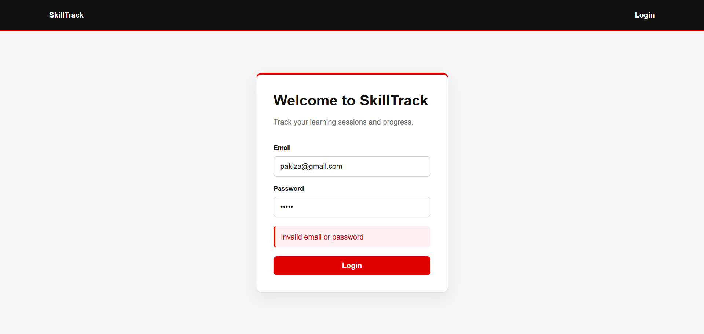
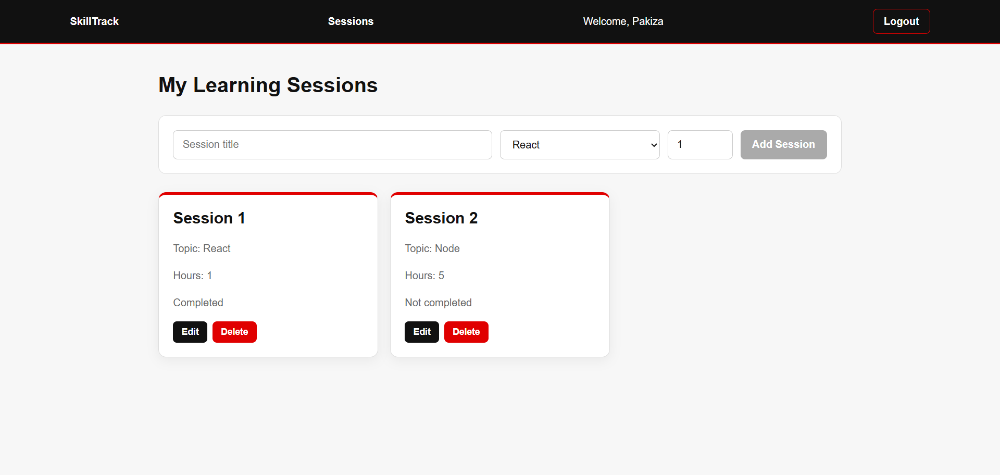
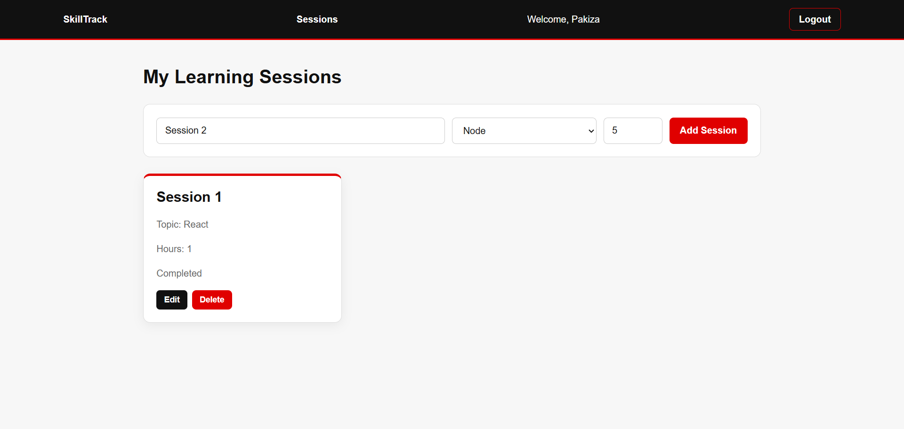

# 📚 SkillTrack

### Learning Session Tracker — React + Redux Toolkit + Express + MongoDB

SkillTrack is a full-stack web application that helps students **record, manage, and track their learning sessions**.

Built as an individual **Week 6 Web Development Workshop project** at the **University of Gujrat**.

---

## 📸 Screenshots

### 🔐 Login



### 📚 Sessions Dashboard



### ➕ Session Management



> Replace the screenshot filenames above with your actual files inside the `screenshots/` folder.

---

## ✨ Features

* 🔐 Login and logout system
* 💾 Persistent login using `localStorage`
* 🛡️ Protected routes
* 📚 Create learning sessions
* ✏️ Edit existing sessions
* 🗑️ Delete sessions
* 📋 View all saved sessions
* ⏳ Loading states
* ⚠️ Error handling
* ✅ Form validation
* 🗃️ MongoDB data storage
* 🔄 Redux-based shared state management
* 🌐 REST API using Express.js
* 📱 Responsive custom CSS

---

## 🛠️ Tech Stack

### Frontend

| Technology    | Purpose                     |
| ------------- | --------------------------- |
| React.js      | User interface              |
| Vite          | Development environment     |
| Redux Toolkit | State management            |
| React Redux   | Connecting Redux with React |
| React Router  | Routing and protected pages |
| Axios         | API requests                |
| CSS           | Custom styling              |

### Backend

| Technology | Purpose                        |
| ---------- | ------------------------------ |
| Node.js    | JavaScript runtime             |
| Express.js | REST API                       |
| MongoDB    | Database                       |
| Mongoose   | MongoDB object modeling        |
| dotenv     | Environment variables          |
| CORS       | Frontend-backend communication |

---

## 📁 Project Structure

```text
skilltrack/
│
├── client/
│   ├── src/
│   │   ├── api/
│   │   │   └── api.js
│   │   │
│   │   ├── app/
│   │   │   └── store.js
│   │   │
│   │   ├── features/
│   │   │   ├── auth/
│   │   │   │   └── authSlice.js
│   │   │   └── sessions/
│   │   │       └── sessionsSlice.js
│   │   │
│   │   ├── components/
│   │   │   ├── Navbar.jsx
│   │   │   ├── ProtectedRoute.jsx
│   │   │   └── SessionCard.jsx
│   │   │
│   │   ├── pages/
│   │   │   ├── Login.jsx
│   │   │   ├── Sessions.jsx
│   │   │   ├── EditSession.jsx
│   │   │   └── NotFound.jsx
│   │   │
│   │   ├── styles/
│   │   │   └── index.css
│   │   │
│   │   ├── App.jsx
│   │   └── main.jsx
│   │
│   └── package.json
│
├── server/
│   ├── config/
│   │   └── db.js
│   │
│   ├── middleware/
│   │   ├── logger.js
│   │   └── errorHandler.js
│   │
│   ├── models/
│   │   └── Session.js
│   │
│   ├── routes/
│   │   └── sessions.js
│   │
│   ├
│   ├── server.js
│   └── package.json
│
├── screenshots/
│
├── .gitignore
└── README.md
```

---

## 🔐 Authentication

SkillTrack uses a simple demo login system.

Authentication is handled through a Redux slice containing two demo users.

### Authentication Flow

```text
Login Form
    ↓
Redux Login Action
    ↓
Check Demo Users
    ↓
Valid Credentials?
    ↓
Store User in Redux
    ↓
Save User in localStorage
    ↓
Open Sessions Dashboard
```

> Passwords are not stored in Redux or `localStorage`.

---

## 🛡️ Protected Routes

The application protects pages that require authentication.

| Route                | Access        |
| -------------------- | ------------- |
| `/login`             | Public        |
| `/sessions`          | Protected     |
| `/sessions/:id/edit` | Protected     |
| `*`                  | 404 Not Found |

If a logged-out user tries to access a protected page, they are redirected to the login page.

---

## 📚 Session Management

Each learning session contains:

* **Title** — minimum 3 characters
* **Topic** — React, Node, Database, or Other
* **Hours** — between 1 and 24
* **Notes** — optional
* **Completed** — Boolean value

Users can perform complete CRUD operations:

```text
Create → View → Edit → Delete
```

---

## 🔌 REST API

The backend runs on port `3000`.

| Method   | Endpoint            | Purpose          |
| -------- | ------------------- | ---------------- |
| `GET`    | `/api/sessions`     | Get all sessions |
| `GET`    | `/api/sessions/:id` | Get one session  |
| `POST`   | `/api/sessions`     | Create a session |
| `PUT`    | `/api/sessions/:id` | Update a session |
| `DELETE` | `/api/sessions/:id` | Delete a session |

---

## 🔄 Redux State Management

Redux Toolkit is used for shared application state.

### Authentication State

```text
authSlice
├── user
└── error
```

### Sessions State

```text
sessionsSlice
├── items
├── status
└── error
```

API requests are handled using `createAsyncThunk`.

### Request State

```text
idle
  ↓
loading
  ↓
succeeded
```

or

```text
idle
  ↓
loading
  ↓
failed
```

---

## 🗃️ Database

MongoDB is used to store learning sessions.

Mongoose provides the `Session` model and validates:

* Required title
* Minimum 3-character title
* Required topic
* Valid topic values
* Required study hours
* Hours between 1 and 24
* Optional notes
* Completed status

The MongoDB connection string is stored securely in:

```text
server/.env
```

The `.env` file is excluded from GitHub using `.gitignore`.

---

# 🚀 Installation & Setup

## 1. Clone the Repository

```bash
git clone https://github.com/Pakiza-Aleem/skilltrack.git
cd skilltrack
```

---

## 2. Install Backend Dependencies

```bash
cd server
npm install
```

---

## 3. Configure MongoDB

Create a `.env` file inside the `server` folder:

```text
server/.env
```

Add:

```env
PORT=3000
MONGO_URI=your_mongodb_connection_string
```

Replace `your_mongodb_connection_string` with your MongoDB connection string.

---

## 4. Start the Backend

From the `server` folder:

```bash
npm run dev
```

The API will run at:

```text
http://localhost:3000
```

---

## 5. Install Frontend Dependencies

Open another terminal and navigate to the client:

```bash
cd client
npm install
```

---

## 6. Start the Frontend

```bash
npm run dev
```

Open the Vite URL shown in the terminal.

Usually:

```text
http://localhost:5173
```

---

## 🧪 Testing

The application was tested for:

* ✅ Login validation
* ✅ Persistent login
* ✅ Logout
* ✅ Protected routes
* ✅ Session loading
* ✅ API errors
* ✅ Adding sessions
* ✅ Editing sessions
* ✅ Deleting sessions
* ✅ Form validation
* ✅ MongoDB data storage
* ✅ 404 handling
* ✅ Responsive interface

---

## 🎓 Learning Objectives

This project demonstrates practical understanding of:

### React

* React component development
* JSX
* `useSelector`
* `useDispatch`
* Component-based architecture

### Redux Toolkit

* `configureStore`
* `createSlice`
* `createAsyncThunk`
* `extraReducers`
* Shared application state

### React Router

* Routing
* Protected routes
* Dynamic routes
* 404 pages

### Backend

* Express REST APIs
* Express middleware
* Axios API requests
* CRUD operations
* Error handling

### Database

* MongoDB
* Mongoose schemas
* Mongoose models
* Data validation

### Development

* Git & GitHub
* Environment variables
* Responsive UI development


---

## 👩‍💻 Author

### Pakiza Aleem

**BSCS Student · University of Gujrat**

---

<p align="center">
  Built with ❤️ using React, Redux Toolkit, Express.js and MongoDB.
</p>
